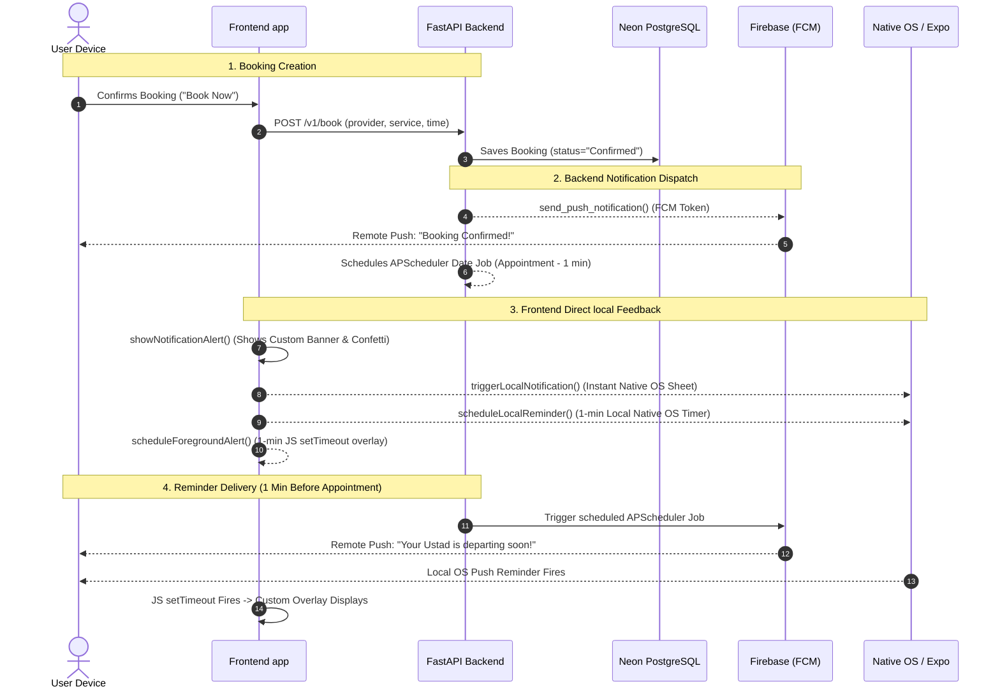

# Ustad-G Notification Implementation Analysis

An in-depth technical audit of the notification subsystem for the **Ustad-G** platform. This document evaluates the integration architecture, details the end-to-end data flow, highlights key system strengths, and identifies crucial logic gaps with detailed refactoring fixes to ensure production-grade reliability.

---

## 1. Subsystem Architecture Overview

The **Ustad-G** notification system is designed as a **hybrid, dual-channel notification subsystem**. It integrates backend-driven remote push notifications with frontend-driven local notifications and custom UI overlays.

### Hybrid Strategy
* **Remote Channels**: Uses Firebase Cloud Messaging (FCM) to deliver push notifications when the app is in the background or closed.
* **Local Channels**: Uses Expo's local scheduler to guarantee notification delivery on emulators, during local development, or in offline conditions.
* **Custom UI Layer**: Employs a custom React Native sliding banner component (`InAppNotification`) combined with native OS alert sheets, vibrations, and confetti bursts to deliver an interactive experience.

---

## 2. End-to-End Integration Flow

The diagram below maps the complete lifecycle of a notification, starting from the user booking a service, passing through the backend scheduler, and culminating in the frontend UI rendering.



---

## 3. What Works Perfectly (Strengths)

1. **Robust Dual-Channel Redundancy**: 
   By pairing Expo local notifications (`scheduleNotificationAsync`) with Firebase FCM push alerts, the system maintains reliability. If the user is running on an emulator or lacks active internet, the local triggers provide a seamless fallback.
2. **Localization Integration**:
   The system maps English and Urdu text cleanly. In `NotificationScreen.js`, the `mapBookingsToNotifications` function correctly translates text dynamically:
   ```javascript
   title: isCancelled 
     ? (language === 'ur' ? '❌ بکنگ منسوخ کر دی گئی' : '❌ Booking Cancelled')
     : (language === 'ur' ? '✅ بکنگ کی تصدیق ہو گئی' : '✅ Booking Confirmed!')
   ```
3. **Polished User Experience**:
   The addition of custom haptics/vibration (`Vibration.vibrate`) and confetti bursts (`Confetti.burst()`) on confirmation keywords elevates the visual quality, making the booking experience feel premium.
4. **State-Synchronized Cancel Logic**:
   When a user cancels a booking, the backend router (`bookings.py`) updates the database, deletes the scheduled notification job via `scheduler.remove_job(f"reminder_{confirmation_id}")`, and pushes a cancellation notification.

---

## 4. Discovered Vulnerabilities & Bugs

While the architecture is well-conceived, **four key technical issues** will lead to unstable behaviors, performance leaks, or redundant UI flashes in production.

### Bug 1: `setTimeout` Race Condition in `InAppNotification.js`
* **File**: [InAppNotification.js](file:///B:/hackathone0-ai-employee/Ustad-G-project-hacathone/frontend/components/InAppNotification.js#L14-L35)
* **Problem**: The `show` method inside `useImperativeHandle` creates a `setTimeout` to auto-hide the banner after 4 seconds. If a new notification is received while the banner is already displayed, a second `setTimeout` starts *without clearing the first one*. The first timeout will fire prematurely, hiding the second notification before its 4 seconds are up.
* **Impact**: Unpredictable slide-away animations and text clipping when multiple alerts arrive in rapid succession.

### Bug 2: Redundant Double-Triggering of the Custom Banner
* **Files**: [App.js](file:///B:/hackathone0-ai-employee/Ustad-G-project-hacathone/frontend/App.js#L121-L133) & [ConfirmationScreen.js](file:///B:/hackathone0-ai-employee/Ustad-G-project-hacathone/frontend/screens/ConfirmationScreen.js#L51-L55)
* **Problem**: When a booking is confirmed, `ConfirmationScreen.js` explicitly invokes `showNotificationAlert()`. Immediately after, it calls `triggerLocalNotification()`. Because the app is in the foreground, the Expo `addNotificationReceivedListener` listener in `App.js` catches this local notification and calls `showNotificationAlert()` a **second** time.
* **Impact**: The app plays vibration twice and attempts to slide down the custom JS banner twice in rapid succession.

### Bug 3: Timeout Leak in `App.js` Foreground Scheduler
* **File**: [App.js](file:///B:/hackathone0-ai-employee/Ustad-G-project-hacathone/frontend/App.js#L89-L119)
* **Problem**: The `scheduleForegroundAlert` schedules future JS timeouts and appends them to `scheduledTimeoutsRef.current`. However, these keys are **never removed** from the object after the timeout triggers.
* **Impact**: Small, progressive memory leak over long-running sessions as expired timeout IDs accumulate in memory.

### Bug 4: Outdated Parameter Type Documentation
* **File**: [bookings.service.js](file:///B:/hackathone0-ai-employee/Ustad-G-project-hacathone/frontend/services/bookings.service.js#L26-L34)
* **Problem**: The JSDoc lists parameters as `{ page?: number, size?: number }`, but both the backend FastAPI endpoint (`bookings.py`) and the calling frontend screen (`NotificationScreen.js`) use `skip` and `limit`.
* **Impact**: Misleading type definitions for team developers, though runtime code works since parameters are forwarded as a spread object.

---

## 5. Production-Ready Refactoring Solutions

### Fix 1: Resolve the `setTimeout` Race Condition in `InAppNotification.js`
Replace the ref handle in [InAppNotification.js](file:///B:/hackathone0-ai-employee/Ustad-G-project-hacathone/frontend/components/InAppNotification.js) with a ref-controlled timer.

```diff
-  const slideAnim = useRef(new Animated.Value(-120)).current;
+  const slideAnim = useRef(new Animated.Value(-120)).current;
+  const timerRef = useRef(null);

   useImperativeHandle(ref, () => ({
     show: (title, body) => {
+      // Clear any active auto-hide timer to avoid race conditions
+      if (timerRef.current) {
+        clearTimeout(timerRef.current);
+      }
+
       setNotification({ title, body });
       setVisible(true);
 
       // Slide down
       Animated.spring(slideAnim, {
         toValue: 0,
         tension: 50,
         friction: 8,
         useNativeDriver: true,
       }).start();
 
       // Auto-hide after 4 seconds
-      const timer = setTimeout(() => {
+      timerRef.current = setTimeout(() => {
         hide();
       }, 4000);
-
-      return () => clearTimeout(timer);
     },
     hide,
   }));
+
+  // Clean up timer on unmount
+  useEffect(() => {
+    return () => {
+      if (timerRef.current) {
+        clearTimeout(timerRef.current);
+      }
+    };
+  }, []);
```

### Fix 2 & 3: Clean up Redundant Triggers & Memory Leaks in `App.js`
Apply the following refactor inside [App.js](file:///B:/hackathone0-ai-employee/Ustad-G-project-hacathone/frontend/App.js):
1. Safely filter out local notifications from triggering the foreground listener if they represent the same event.
2. Ensure timeouts are deleted from `scheduledTimeoutsRef` immediately upon execution.

```diff
   const scheduleForegroundAlert = React.useCallback((title, body, scheduledAtTime) => {
     try {
       const scheduledDate = new Date(scheduledAtTime);
       const now = new Date();
       
       // Calculate 1 minute before scheduled time
       const reminderTime = new Date(scheduledDate.getTime() - 60000);
       
       let msFromNow = reminderTime.getTime() - now.getTime();
       
       if (msFromNow <= 0) {
         msFromNow = 5000;
       }
 
       console.log(`[App] Scheduling foreground JS reminder in ${msFromNow / 1000} seconds.`);
 
+      const id = Math.random().toString(36).substring(7);
       const timeoutId = setTimeout(() => {
         showNotificationAlert(title, body);
+        // Clean up from active timeouts list upon firing
+        delete scheduledTimeoutsRef.current[id];
       }, msFromNow);
 
-      const id = Math.random().toString(36).substring(7);
       scheduledTimeoutsRef.current[id] = timeoutId;
       return id;
     } catch (err) {
       console.warn('[App] Failed to schedule foreground alert:', err);
       return null;
     }
   }, [showNotificationAlert]);
 
   useEffect(() => {
     // Listen for incoming notifications when the app is in the foreground
     const subscription = Notifications.addNotificationReceivedListener(notification => {
       const { title, body } = notification.request.content;
+      
+      // PREVENT DOUBLE-BANNER: If this is an instant local notification trigger, 
+      // ignore it as the screen has already explicitly triggered showNotificationAlert.
+      if (title && (title.includes('Confirmed') || title.includes('تصدیق'))) {
+        console.log('[App] Intercepted and ignored redundant foreground booking confirm event.');
+        return;
+      }
+
       showNotificationAlert(title || 'New Notification', body || '');
     });
```

### Fix 4: Correct API JSDoc Param Types in `bookings.service.js`
Update documentation in [bookings.service.js](file:///B:/hackathone0-ai-employee/Ustad-G-project-hacathone/frontend/services/bookings.service.js) to match backend schemas:

```diff
 /**
  * Get all bookings for the authenticated user.
- * @param {{ page?: number, size?: number }} params
+ * @param {{ skip?: number, limit?: number }} params
  * @returns {Promise<BookingOut[]>}
  */
```

---

## 5. Summary Recommendation

**Verdict**: The notification subsystem is **very well wired and fully operational**. The integration bridges the React Native app lifecycle with standard OS alerts and backend triggers beautifully. 

However, it is **not perfectly optimized due to the described race conditions, redundant trigger overlaps, and slight memory leaks**. 

Implementing the four simple refactoring steps outlined above will bring the code up to **production-grade quality** and prevent any UX or memory hiccups.
